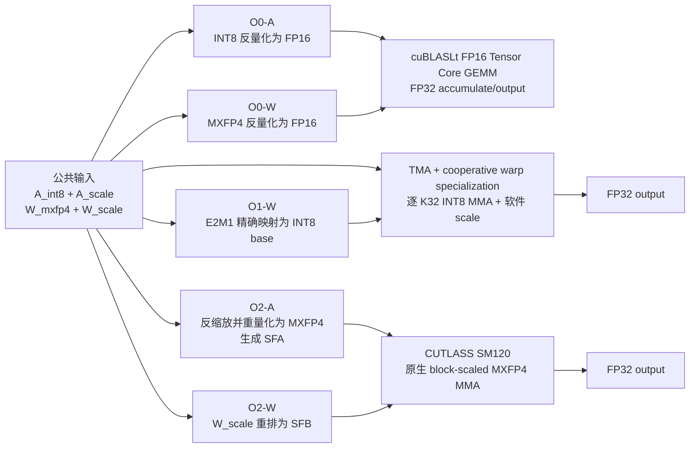

# O0/O1/O2 后端实现、差异与实验测量说明

> 文档定位：面向实验汇报、阶段答辩和结果解读。本文描述 RTX 5090（SM120a）上的当前正式后端，以及已经采用的 MSE 与计时口径。凡标注为“拟议优化”的内容均尚未进入当前实现和现有实验结果。

## 1. 实验目标与公共起点

本实验固定计算：

\[
Y=AW^T,\qquad M=N=K=4096
\]

- \(M=4096\)：激活矩阵行数，即本次 prefill 的有效 token 数；
- \(N=4096\)：Linear 层输出维度；
- \(K=4096\)：Linear 层输入维度，也是点积的归约维度；
- 三种配置均生成 `[4096,4096]` FP32 输出。

三种配置从完全相同的公共准备数据开始：

```text
A_int8      [M,K]      int8
A_scale     [M]        fp32
W_mxfp4     [N,K/2]    packed uint8，每字节存放两个 E2M1
W_scale     [N,K/32]   UE8M0 uint8
```

它们表示的近似实数为：

\[
\hat A_{m,k}=A_{\mathrm{int8},m,k}s^A_m
\]

\[
\hat W_{n,k}=E2M1(W_{n,k})s^W_{n,g},\qquad g=\lfloor k/32\rfloor
\]

从原始 FP16 trace 生成上述公共数据属于所有配置共享的离线准备，不计入 O0/O1/O2 转换时间。实验比较的是：从同一 `A_int8/A_scale/W_mxfp4/W_scale` 出发，使用不同计算路径得到 FP32 输出所需的转换开销、GEMM 时间、端到端时间和相对 O0 的输出误差。

因此，本实验回答的是“完整配置在 RTX 5090 上的系统性能”，不是只比较某一条 Tensor Core 指令的理论峰值。

## 2. 三种后端总体数据流



三条路径最核心的区别是 scale 在哪里生效：

| 配置 | scale 的处理位置 |
|---|---|
| O0 | GEMM 前反量化时乘入，GEMM 只看到普通 FP16 A/W |
| O1 | 每个 K32 的 INT8 MMA 得到 INT32 partial 后，由软件乘 scale 并累加 |
| O2 | SFA/SFB 作为原生 block-scaled MMA 输入，由硬件指令在 MMA 内处理 |

## 3. O0：反量化为 FP16 后执行标准 GEMM

### 3.1 数值路径

O0 先将公共量化输入恢复成 FP16：

\[
A^{(0)}_{m,k}=FP16(A_{\mathrm{int8},m,k}s^A_m)
\]

\[
W^{(0)}_{n,k}=FP16(E2M1(W_{n,k})s^W_{n,g})
\]

然后执行：

\[
Y^{(0)}=A^{(0)}(W^{(0)})^T
\]

GEMM 输入为 FP16，乘加使用 FP32 accumulator，最终输出为 FP32。

O0 不是在本轮计时区间内“先量化再反量化”。公共 INT8/MXFP4 量化早已在 `prepare_trace.py` 阶段完成并由三种方案共享；O0 在线工作只是从公共量化输入反量化到 FP16，再执行 FP16 GEMM。

### 3.2 工程实现

- 权重转换：`MXFP4 + UE8M0/K32 -> FP16`；
- 激活转换：`INT8 + per-row FP32 scale -> FP16`；
- GEMM：cuBLASLt；
- 强制算法标志包含 HMMA、FP16 input 和 FP32 accumulator；
- `compute_type = CUBLAS_COMPUTE_32F`；
- `split_k <= 1`；
- workspace、转换目标和输出均在计时前分配。

相关代码：

- `csrc/sm120/conversion.cu`
- `csrc/sm120/o0_gemm.cu`

### 3.3 O0 为什么很快

O0 在 GEMM 前完成所有 scale。GEMM 本身是规则的单次 `4096 x 4096 x 4096` FP16 GEMM，cuBLASLt 可以使用成熟的分块、流水线、数据复用和 Tensor Core 调度策略。GEMM 主循环没有逐 K32 scale 解码、INT32-to-FP32 转换或软件 scale 累加。

O0 的代价是生成完整 FP16 A/W，转换输出体积较大；但在当前大矩阵上，规则 GEMM 的高效率仍使其明显快于当前 O1。

## 4. O1：INT8 MMA 与逐 K32 软件 scale

### 4.1 权重的精确 INT8 base 映射

E2M1 的非负数值集合为：

```text
{0, 0.5, 1, 1.5, 2, 3, 4, 6}
```

O1 将其精确映射为：

```text
{0, 1, 2, 3, 4, 6, 8, 12}
```

记映射后的整数为 \(B_{n,k}\)，则：

\[
E2M1(W_{n,k})=B_{n,k}/2
\]

该转换只改变数值表示，不使用 `W_scale`，也不会再引入一次舍入误差。

### 4.2 逐 K32 计算公式

普通 INT8 MMA 接收 INT8 A、INT8 B，并生成 INT32 accumulator；它不接受 UE8M0 scale。O1 必须对每个 K32 显式处理 scale：

\[
P^{(g)}_{m,n}=\sum_{k=32g}^{32g+31}A_{\mathrm{int8},m,k}B_{n,k}
\]

\[
Y^{(1)}_{m,n}=\sum_{g=0}^{K/32-1}FP32(P^{(g)}_{m,n})
\left(s^A_ms^W_{n,g}/2\right)
\]

当 \(K=4096\) 时共有 128 个 K32 分组。“逐 K32”不等于启动 128 个全矩阵 GEMM：当前正式实现已把 128 组放入一个 tiled GEMM kernel 的 K 循环，每个最终输出元素只写全局显存一次。

### 4.3 当前正式 kernel

当前 production 使用保留的 `adangel_o1_shared_partial_baseline` kernel：

```text
CTA tile       = 64 x 32 x 32
threads/CTA    = 288
producer warp  = 1
consumer warps = 8
TMA pipeline   = 3 stages
MMA            = nvcuda::wmma m16n16k16, S8 x S8 -> S32
```

一个 CTA 最终负责 `Y[64,32]`。每次 K32 循环读取 `A_tile[64,32]` 和 `W_tile[32,32]`：

1. producer warp 通过 TMA 把下一组 A/W tile 搬入三阶段共享内存流水线；
2. 8 个 consumer warp 将 `64x32` 输出划分为 8 个 `16x16` 子块；
3. 每个 consumer warp 执行两次 `m16n16k16`，覆盖完整 K32；
4. 得到该 K32 的 INT32 partial；
5. partial 转 FP32，乘 `A_scale * decode_ue8m0(W_scale) / 2`；
6. 累加到线程持有的 FP32 最终 accumulator；
7. 128 组完成后，最终 FP32 输出只写全局显存一次。

相关代码：

- `csrc/sm120/conversion.cu`
- `csrc/sm120/o1_gemm.cu`

源码还包含 `adangel_o1_register_partial_64x32` 与
`adangel_o1_register_partial_128x128` 两个内部候选。RTX 5090 验收前，公开
`run_o1()` 不会选择它们，下面的历史性能和 MSE 也仍属于 shared baseline。

### 4.4 当前 O1 的关键瓶颈

当前实现没有全局 partial buffer，但 partial 尚未全程留在寄存器中：

```text
WMMA INT32 fragment（寄存器）
  -> wmma::store_matrix_sync
  -> shared_storage.shared_partial（共享内存）
  -> consumer named barrier
  -> 按逻辑输出坐标重新读取
  -> INT32 转 FP32、乘 scale、累加到 FP32 寄存器
  -> 第二次 barrier，允许下一组覆盖 partial 区域
```

原因是 `nvcuda::wmma::fragment` 的寄存器元素与逻辑矩阵坐标之间的映射不适合直接依赖。先存为行主序共享内存，可以明确找到每个 `(row,column)` partial 并匹配正确的行、列 scale，但会引入额外共享内存流量和同步。

对 `4096^3` 作量级估算：

- 每 CTA partial tile：`64 x 32 x 4 B = 8 KiB`；
- 每 K32 至少一次写和一次读，约 16 KiB；
- 128 组约为每 CTA 2 MiB；
- 网格共有 `(4096/64) x (4096/32) = 8192` 个 CTA；
- 聚合 partial 共享内存读写约 16 GiB，此外还有每组同步、类型转换和软件 scale。

这解释了当前 O1 即使已采用 TMA、warp specialization 和单 kernel，仍可能慢于 O0。瓶颈不是 INT8 Tensor Core 本身，而是普通 INT8 MMA 缺乏原生 block scale 输入，导致每个 K32 都要走软件后处理。

## 5. O2：原生 SM120 block-scaled MXFP4 GEMM

### 5.1 激活在线重量化

O2 权重已经是 MXFP4，激活需要从公共 INT8 表示重新量化：

```text
A_int8 * A_scale
  -> 每行每 K32 求 amax
  -> 生成 UE8M0 scale
  -> 归一化并按 RNE 量化为 E2M1
  -> 两个 E2M1 packed 到一个 uint8
```

每个 warp 处理一个 K32。对非零块：

\[
e=clamp(\lfloor\log_2(amax)\rfloor-2,-127,127),\quad
s=2^e,\quad scale\_code=e+127
\]

全零块使用 `scale_code=127`，即 scale 为 1。E2M1 量化采用 round-to-nearest、ties-to-even；偶数 K 放低 nibble，奇数 K 放高 nibble。

### 5.2 SFA/SFB scale layout

自然顺序 scale 是 `A_mx_scale[M,K/32]` 和 `W_scale[N,K/32]`。SM120 MXFP4 MMA 对 scale fragment 的物理排布有专门要求，因此 O2 使用 `cutlass::detail::Sm1xxBlockScaledConfig<32>` 生成 SFA/SFB physical layout：

- `A_mx_scale natural -> SFA`；
- `W_scale natural -> SFB`。

O2-W 确实存在转换开销，但它只是 `W_scale` 的布局重排，不是权重重新量化。`W_mxfp4` packed 数据不复制、不转置，直接解释为 ColumnMajor `B[K,N]`。

### 5.3 正式 CUTLASS kernel

O2 使用 CUTLASS `GemmUniversalAdapter`：

```text
A/B element          E2M1 MXFP4
Scale                UE8M0, vector size 32
Accumulator/output   FP32
CTA tile             128 x 128 x 256
Cluster              1 x 1 x 1
Mainloop             TMA
Schedule             KernelTmaWarpSpecializedCooperative
Stage policy         StageCountAutoCarveout
```

目标 MMA：

```text
mma.sync.aligned.kind::mxf4.block_scale.scale_vec::2X.
m16n8k64.row.col.f32.e2m1.e2m1.f32.ue8m0
```

O2 的 MMA 接口原生接收 MXFP4 数据和 UE8M0 scale。逐 K32 scale 仍然存在，但由 block-scaled MMA 主循环按硬件规定消费，不需要像 O1 一样在每个 K32 后执行软件 scale 路径。

正式运行前调用 `can_implement` 和 `initialize`；条件不满足时直接报错，不允许退化到软件参考实现。相关代码为 `csrc/sm120/o2_cutlass.cu`。

## 6. O0/O1/O2 集中对比

| 项目 | O0 | O1 | O2 |
|---|---|---|---|
| 激活在线处理 | INT8 反量化为 FP16 | 保持 INT8 | 反缩放并重量化为 MXFP4，SFA 重排 |
| 权重在线/冷启动处理 | MXFP4 反量化为 FP16 | E2M1 精确映射为 INT8 base | 只把 W scale 重排为 SFB |
| GEMM 类型 | FP16 x FP16 | INT8 x INT8 | MXFP4 x MXFP4 |
| Tensor Core partial | FP32 | INT32 | FP32 |
| 最终累加/输出 | FP32 / FP32 | 软件 scale 后 FP32 / FP32 | FP32 / FP32 |
| K32 scale 位置 | GEMM 前乘入 | 每 K32 后软件处理 | 原生 block-scaled MMA 内处理 |
| 搬运/调度 | cuBLASLt 内部 | 显式 TMA + cooperative warp specialization | CUTLASS TMA + cooperative warp specialization |
| CTA tile | cuBLASLt 决定 | `64x32x32` | `128x128x256` |
| 全局 partial buffer | 无 | 无 | 无 |
| 最终输出写入 | 一次 | 一次 | 一次 |
| 当前主要优势 | 标准大 GEMM 高度优化 | 保留 INT8 激活；E2M1 映射精确 | 原生 FP4 吞吐高；scale 由 MMA 消费 |
| 当前主要代价 | 生成完整 FP16 A/W | 软件 K32 scale、共享内存 partial 中转 | 激活再次量化；SFA/SFB layout |

三种实现使用不同 CTA tile 是合理的。tile 选择受 MMA shape、数据位宽、共享内存、寄存器压力、scale 布局和流水线深度共同约束。强制使用同一 tile 不会让比较更公平，反而可能让某种数据类型采用明显不适合的实现。

## 7. 比较的公平性与结论边界

共同条件包括：同一 RTX 5090、同一 CUDA stream、同一批 24 个真实 Llama-2-7B FP16 prefill trace、同一公共量化输入、相同 `4096^3` 形状、相同 FP32 输出、相同 warmup/repeat/CV 门限，以及正式后端正确性测试与指令审计。O1/O2 也都采用 TMA、cooperative warp specialization 和单 kernel tiled GEMM。

不可避免的差异来自方案定义：O0 需要 FP16 反量化；O1 需要 E2M1-to-INT8 和软件 K32 scale；O2 需要激活 MXFP4 重量化、SFA/SFB layout 和原生 block-scaled MMA。

因此，实验可以公平回答三种完整配置在当前硬件和默认优化水平下的转换、GEMM、端到端性能及输出差异；但不能把结果解释为 FP16、INT8、MXFP4 单条指令理论吞吐的纯粹对比。尤其 O1-GEMM 包含软件 scale、类型转换、同步和 FP32 累加。

## 8. MSE 的定义、计算与解读

### 8.1 参考输出与公式

每个样本只保存一次 O0 `compute_only` FP32 输出，作为唯一主参考：

\[
Y_{ref}=Y_{O0}
\]

\[
MSE(O_i,O0)=\frac{1}{MN}\sum_{m=1}^{M}\sum_{n=1}^{N}
\left(Y_{O_i,m,n}-Y_{O0,m,n}\right)^2
\]

实现先将两个 FP32 输出转为 FP64，再做差、平方和 mean reduction，以降低指标归约自身的数值误差。输出含 NaN/Inf 时直接判错。

### 8.2 MSE 表示什么

MSE 比较两个完整 `[4096,4096]` 输出矩阵，不是比较权重编码、激活编码或单个 partial。

- O0 对自身 MSE 恒为 0；
- O1 与 O0 共用同一 INT8 激活和 MXFP4 权重，且 E2M1-to-INT8 base 映射精确，差异通常很小；
- O2 对激活执行额外一次 MXFP4 重量化，通常比 O1 有更明显的 MSE；
- MSE 是绝对误差尺度，受输出幅度影响，不等于模型困惑度、任务精度或相对误差。

O0 本身也是从公共量化输入反量化得到的基线，不等于原始 FP16 模型输出。因此 `MSE vs O0` 不能度量公共 INT8/MXFP4 预处理相对原始 FP16 trace 的全部误差。

### 8.3 24 样本汇总

对每个 variant 报告 24 个逐样本 MSE、median、IQR、最大值和 bootstrap median 95% 置信区间。运行器用 `compute_only` 输出计算 MSE，再把同一 variant/sample 的 MSE 写入该样本四种 mode 的记录；不能把四个 mode 中重复的同一个 MSE 当成四次独立观测。

当前一次 24 样本正式运行的摘要为：

| variant | median MSE vs O0 | max MSE vs O0 |
|---|---:|---:|
| O0 | 0 | 0 |
| O1 | `9.8234e-09` | `2.7278e-08` |
| O2 | `3.7960e-03` | `1.5460e-02` |

以上用于说明当前结果量级；最终汇报的精确 IQR 和 bootstrap CI 应从已验收 run 生成的 `04_mse.csv` 读取。

## 9. 四种计时模式

### 9.1 Conversion-only

只回答格式转换本身需要多久：

| 配置 | 转换阶段 |
|---|---|
| O0 | O0-W：MXFP4-to-FP16；O0-A：INT8-to-FP16 |
| O1 | O1-W：MXFP4 E2M1-to-INT8 base |
| O2 | O2-W：W_scale natural-to-SFB；O2-A：反缩放、MXFP4 量化、natural scale-to-SFA |

为了让 API 仍返回有效输出，后端可在 conversion-only 计时区间外执行一次 GEMM；该 GEMM 不计入 conversion-only 时间。

### 9.2 Compute-only

所有当前配置所需转换均提前完成并缓存，只测正式 GEMM：

- O0：预先得到 FP16 A/W；
- O1：预先得到 INT8 W，A 本来就是 INT8；
- O2：预先得到 MXFP4 A、SFA 和 SFB；
- `total` 与 `gemm` 是同一条单次直接路径。

O1-GEMM 仍包含逐 K32 软件 scale，因为这是 O1 计算语义的一部分。

### 9.3 Cold end-to-end

从公共 prepared inputs 出发，包含该配置的全部转换与 GEMM：

```text
O0 cold = W反量化 + A反量化 + FP16 GEMM
O1 cold = W转INT8 + O1 fused tiled GEMM
O2 cold = W_scale重排 + A重量化/SFA重排 + MXFP4 GEMM
```

它表示没有任何配置专用缓存时的一次调用成本。

### 9.4 Steady-state end-to-end

假定静态权重侧转换已经缓存：

```text
O0 steady = A反量化 + FP16 GEMM
O1 steady = O1 fused tiled GEMM
O2 steady = A重量化/SFA重排 + MXFP4 GEMM
```

O1 没有在线激活转换，因为公共激活已经是 O1 所需 INT8；O2 缓存 SFB，但每个新激活仍需量化并生成 SFA。

## 10. 双轨计时方法

当前项目采用“转换阶段批量摊销计时 + 端到端单次直接计时”。

### 10.1 转换组件：批量摊销

O0-W、O0-A、O1-W、O2-W 和 O2-A 都是微秒级操作。单次 CUDA Event 容易被 event 分辨率和偶发调度抖动放大，因此每个外层测量样本执行：

```text
event_start
连续执行 conversion_inner_repeats=100 次同一转换
event_end

单次估计 = (event_end - event_start) / 100
```

`conversion_only/total` 也对该 variant 的完整转换序列执行 100 次后摊销。所有 buffer 在计时前分配，计时区间内没有内存申请或文件 I/O。

### 10.2 端到端 total：单次直接路径

以下 total 不做 inner repeat：

- `compute_only/total`；
- `cold/total`；
- `steady_state/total`。

每个外层样本只执行一次对应真实路径。特别是 cold 只包含一次权重转换，steady-state 继续使用缓存后的静态权重。

### 10.3 为什么组件之和不必等于 total

转换组件与端到端 total 相互隔离、分别测量：转换组件来自独立的 100 次批量区间，cold/steady total 来自一次直接执行，各列最终又分别取 median。因此：

\[
median(W)+median(A)+median(GEMM)\neq median(direct\ total)
\]

是正常现象。延迟分解图说明阶段量级，正式端到端结论必须以 `total` 的 direct measurement 为准。

## 11. 统计量与吞吐指标

正式配置默认：

```text
warmup = 50
repeats = 200
single CUDA stream
conversion_inner_repeats = 100
max_cv_percent = 3.0
```

CUDA Event 在预热前统一预分配；预热同步后立即进入正式测量，二者之间不创建Event、
不申请显存且不做文件 I/O，避免CPU侧准备空档引入GPU动态升频阶段。

O0/O1/O2 在每个 mode 内交错运行，以减小温度和 boost 频率漂移造成的系统偏差。

| 指标 | 含义 |
|---|---|
| `mean_ms` | 200 次延迟算术平均值，对极端离群值较敏感 |
| `median_ms` | 第 50 百分位，主延迟指标；一半样本不大于它，一半不小于它 |
| `p5_ms/p95_ms` | 第 5/95 百分位，观察主要分布范围 |
| `iqr_ms` | Q3-Q1，中间 50% 样本跨度 |
| `cv_percent` | population standard deviation / mean x 100%，衡量相对波动 |

所有记录阶段必须满足 `CV < 3%`，否则 record 标记为 invalid，不能静默进入主表。若确认是偶发调度离群值，应以完全相同配置重测整个目标 record，并保留原失败记录与 retry provenance，不能手工删除单个 timing sample。

### 11.1 GEMM 等效吞吐

\[
Equivalent\ Throughput=\frac{2MNK}{t_{gemm}}
\]

代码换算为 `equivalent_tflops`。它统一使用 dense GEMM 的 \(2MNK\)，便于比较相同矩阵问题的有效吞吐。

“Equivalent TFLOP/s”不表示 O1 实际执行浮点乘法，也不等于 INT8/MXFP4 指令裸峰值。O1 时间包含软件 scale，O2 时间包含原生 block-scale 主循环。

### 11.2 转换吞吐

\[
Conversion\ GB/s=\frac{logical\ bytes\ moved}{median\ time}
\]

逻辑读写字节：

```text
O0-W = N*K/2 + N*(K/32) + 2*N*K
O0-A = M*K + 4*M + 2*M*K
O1-W = N*K/2 + N*K
O2-W = 2*N*(K/32)
O2-A = M*K + 4*M + M*K/2 + 3*M*(K/32)
```

O2-W 统计自然 W scale 读取与有效 SFB scale 写入。O2-A 的三个 scale 项对应 natural scale 写、natural scale 读和有效 SFA 写。未触碰的 physical-layout padding 不计入逻辑字节。

### 11.3 当前 compute-only 性能量级

当前一次 24 样本正式运行的跨样本 median 摘要：

| variant | median latency | equivalent throughput | speedup vs O0 |
|---|---:|---:|---:|
| O0 | `0.766688 ms` | `179.263 TFLOP/s` | `1.000x` |
| O1 | `1.661712 ms` | `82.709 TFLOP/s` | `0.461x` |
| O2 | `0.132768 ms` | `1035.181 TFLOP/s` | `5.775x` |

当前 O1 约为 O0 延迟的 2.17 倍。它与实现分析一致：O1 已避免 128 次全矩阵 kernel 启动和全局 partial 落盘，但仍承担逐 K32 软件 scale、partial 共享内存中转和同步。

这些数字是当前硬件和实现的测量结果，不是代码中的固定验收门槛。最终汇报应以选定的已验收 run 及其环境文件为准。

## 12. O1 寄存器 partial 候选与 CTA 消融

> **状态：两个候选已写入源码和内部 A/B 接口，但尚未在 RTX 5090 完成编译、指令/资源审计和 24 样本性能验收。production 与 `1.661712 ms` 历史结果仍是 shared-partial baseline。**

当前实现状态如下：

| 实现 | CTA | producer/consumer | MMA | partial 路径 | 状态 |
|---|---|---|---|---|---|
| `shared_partial` | `64x32x32` | `1/8` | WMMA m16n16k16×2 | shared 中转与两次 barrier | production baseline |
| `register_64x32` | `64x32x32` | `1/8` | CuTe m16n8k32 | 寄存器内缩放/累加 | 第一候选 |
| `register_128x128` | `128x128x32` | `1/16` | CuTe m16n8k32 | 寄存器内缩放/累加 | CTA 消融候选 |
| O2 | `128x128x256` | CUTLASS cooperative | MXFP4 block-scaled | 硬件消费 scale | 保持不变 |

寄存器候选使用 `thr_mma.partition_C(identity_tensor)` 建立 accumulator register 与
逻辑 `(row,column)` 的对应关系。A row scale 在 K 循环前放入寄存器；每个 K32 的
W column scale 由 warp lane 加载并 shuffle 广播；INT32→FP32、scale 与 FP32 累加
均在寄存器内完成。TMA A/W 三阶段共享内存 pipeline 仍然保留。

候选通过以下全部条件后才可晋升：reference 与边界 shape 正确；24 样本 O1-vs-O0
MSE 相对 baseline 满足 `rtol=1e-5, atol=1e-12`；所有计时阶段 CV<3%；
compute-only 配对加速比 bootstrap 95% CI 下界>1；同一候选 SASS 内同时出现
TMA/IMMA 且无 `LDL/STL` spill。没有绝对延迟门槛。

`register_128x128` 只令 M/N tile 与 O2 相同，K tile 仍为32；O2 K tile 为256且在
原生 block-scaled MMA 中消费8组 K32 scale。因此不强制 O1/O2 完整 CTA 相同。


### 12.1 优化目标

保留当前 O1 已具备的设计：

- TMA 搬运 A/W；
- cooperative warp specialization；
- 单 kernel tiled GEMM；
- 三阶段 A/W shared-memory pipeline；
- 精确 E2M1-to-INT8 base 映射；
- 每 K32 独立 `W_scale`；
- INT32 partial、FP32 最终累加和 FP32 输出；
- 每个输出元素只写全局显存一次。

寄存器候选只修改 partial 后处理路径：

```text
baseline：
INT32 MMA register fragment
  -> shared partial
  -> barrier
  -> shared reload/remap
  -> scale
  -> FP32 accumulator register

register candidate：
INT32 MMA result registers
  -> 直接匹配本线程所拥有元素的 row/column scale
  -> INT32-to-FP32 + scale
  -> FP32 accumulator registers
```

“partial 留在寄存器”不表示完全不使用共享内存。TMA 搬入的 A/W tile 仍需要共享内存多阶段流水线；候选消除的是 `shared_storage.shared_partial` 以及围绕它的中转和 named barrier。

### 12.2 为什么不能只删除 `store_matrix_sync`

每个 partial 元素需要乘：

\[
s^A_{row}s^W_{column,group}/2
\]

因此必须知道每个 accumulator register 对应 tile 的哪一行、哪一列。`nvcuda::wmma::fragment` 内部元素映射不应作为稳定、公开的逻辑布局直接依赖，当前实现才使用 shared-memory row-major 中转恢复坐标。

当前候选使用 CuTe 明确表达寄存器布局：

1. `partition_C(identity_tensor)` 建立 accumulator register 的行列坐标；
2. m16n8k32 atom 一次完成一个 K32 INT8 MMA；
3. A row scale 预取，W column/group scale 由 warp shuffle 广播；
4. 在寄存器内完成 INT32→FP32、缩放和按 group 顺序累加。

### 12.3 预期收益与仍然存在的成本

预期消除：

- 约 16 GiB 量级的聚合 shared partial 读写；
- 每 K32 围绕 partial 重分发的两次 consumer barrier；
- shared partial 容量占用。

仍无法消除：

- 128 个 K32 迭代；
- 每 K32 的 `W_scale` 获取/解码；
- INT32-to-FP32 转换；
- `A_scale * W_scale / 2`；
- 每 K32 对 FP32 accumulator 的乘加；
- 相比原生 block-scaled MMA 更复杂的软件数据通路。

因此该优化应改善当前 O1 的结构性瓶颈，但不能预先保证 O1 一定快于 O0，也不应以“必须达到某个绝对延迟”作为正确性验收条件。

### 12.4 晋升 production 的验收要求

候选必须重新执行：

1. 小规模 Python reference 对齐和边界 shape 测试；
2. `4096^3` O1 正确性、四种 mode、缓存语义和 CV 验证；
3. O1 相对 O0 的 MSE 回归，确认未改变 K32 scale 与累加语义；
4. 生产 kernel 指令审计，确认同一 kernel 中仍有 TMA 和 IMMA；
5. SASS/源码检查，确认不再有 partial shared-memory store/reload；
6. 与当前 O1 的 compute-only、cold、steady-state 结果做前后对照。

候选结果元数据必须包含：

```text
partial_storage = register
shared_partial_redistribution = false
```

在这些条件通过前，所有图表都应标注为“shared-partial O1 baseline”，不能把已编码但未验收的候选当成正式后端结果。

## 13. 指令审计与结果边界

一次性审计用于证明正式后端没有退化：

- O0：使用 FP16 Tensor Core/HMMA；
- O1：TMA load 与 INT8 IMMA 属于同一个正式 O1 kernel；
- O2：TMA load 与 MXFP4 block-scaled MMA 属于同一个正式 CUTLASS O2 kernel；
- probe/microkernel 只能用于布局和 ISA 验证，不能代替正式 kernel 命中。

审计是正确性与实现真实性门槛，不作为主性能结果，也不等价于完整 GPU profiling。

## 14. 汇报建议结论顺序

1. 三种配置从完全相同的公共量化输入出发，最终输出统一为 FP32；
2. O0 把 scale 前置到 FP16 反量化，随后执行高度优化的标准 GEMM；
3. O1 使用 INT8 Tensor Core，但普通 INT8 MMA 不支持 UE8M0 block scale，必须逐 K32 软件缩放；
4. 寄存器 partial 候选已实现但尚待 5090 A/B 晋升；历史 O1 数字仍是 shared-partial baseline；
5. O2 使用原生 block-scaled MXFP4 MMA，逐 K32 scale 由指令消费，GEMM 性能最高；
6. O1 相对 O0 的 MSE 极小，O2 因激活再次量化而有更明显误差；
7. 转换开销使用批量摊销，端到端 total 使用单次直接计时，不能简单把阶段 median 相加；
8. 最终结论要同时呈现转换成本、compute-only、cold/steady-state 和 MSE，不能只看吞吐图。
